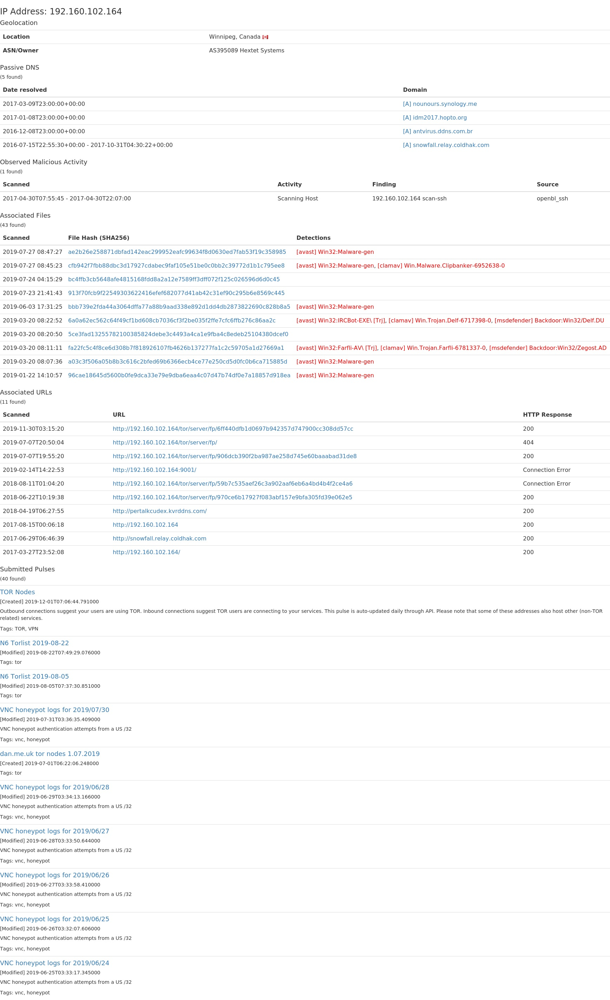
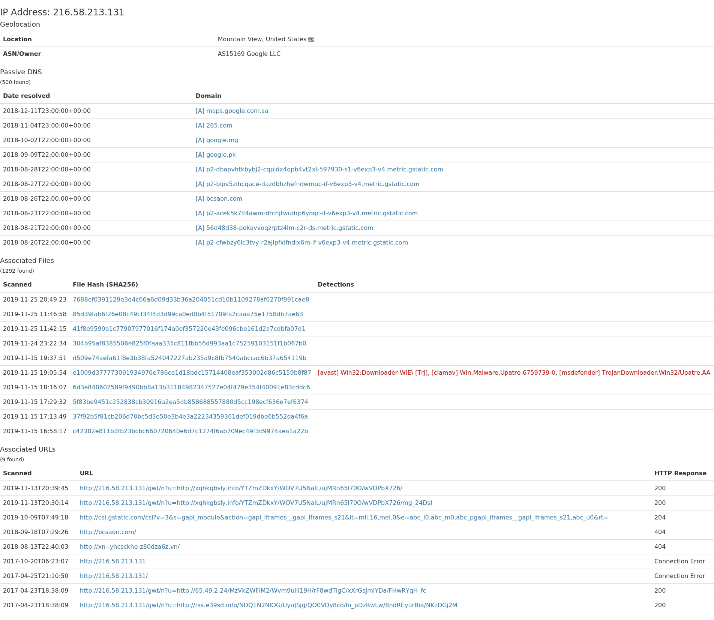

# AlienVault OTX API HTML

The alienvault-otx-api-html project allows getting HTML reports using the AlienVault OTX API.

Features included:

- Analyzing bulk IP addresses (one or more) and getting the HTML report in HTML format: pure HTML (only HTML balises) or PNG screenshot of the report included on the HTML page.
- Multiple API keys can be used to remediate the limitation of the number of requests if there is any limitation per minute/day/month for free accounts (even if I don't think there is such limitation). So analyzing multiple IPs will be possible.
- Since the analysis output can be huge, it is possible to fix the rows limit number for every part of analysis using only a configuration file.
- It is possible to rename every part of the analysis to get a custom sections
- The HTML page's style is customizable from the HTML header.
- The viewed HTML tables are also customizable using class attribute if it is necessary to use a predefined style class.

This project only support IP address analysis.

**TO DO** on the next releases:
- Adding pagination on the HTML report with a "show more results" option.
- Adding domain analysis.
- Adding URL analysis.
- Adding the file hash Analysis.

## Installation
You need to download this project and install the Linux packages and the Python3 packages using these commands:

```
git clone https://github.com/mohamedaymenkarmous/alienvault-otx-api-html
cd alienvault-otx-api-html
python ./setup.py
```

## Configuration
You have to edit the config.json file which is a clone of this file: [config.json.bak](config.json.bak).

The most important thing is the AlienVault OTX API Keys. You need at least one API Key. But if you have more, you can add them to the configuration file:
```
{
  ...
  "AlienVault-OTX": {
    "APIKeys": [
      "YOUR_ALIENVAULT_OTX_API_KEY",
      "ANOTHER_OPTIONAL_ALIENVAULT_OTX_API_KEY_IF_YOU_NEED_MORE"
    ],
   ...
  }
}
```
The main python script [AlienVault-OTX.py](AlienVault-OTX.py) will use all the API keys with rotating over them every time a request will be performed and the last used API key will be remembered by its index.

Other pre-configured sections:
- General > OutputDir: it's the location where the HTML and JPG files will be created. If you are using a VPS instance without GUI and you want to view the reports, you can install a web server over there and choose the output directory inside the Web Document Root directory.
- General > TablesClass: it's the <table> class atrribute's value that will be set on the HTML reports. The default class was set to have a table style inherited from Bootstrap.
- General > HTMLHeader: it's the HTML code that will be set on the HTML <header>. So if you have need to add custom styles/header, you should put it there.
- AlienVault-OTX > DisabledAttr: it's the list of the attributes that will not be viewed on the reports. This include Whois results and the last used HTTPS certificate results.
- AlienVault-OTX > MaxResults: as said above, some results returned by the AlienVault OTX API can reach the 100 results (detected and undetected attributes) and others reach 1000 results (resolutions attribute). This will created a long report. So if you want to limit the output, you can fix it.
- AlienVault-OTX > Order: it's a list that contains the priority section names (attributes) that should be set on the head of the report. If there is at least one element on this list, the order feature will be enabled. If there are another section names that are not set on this list, they will be set at the end of the list.
- AlienVault-OTX > AttrSubstitution: it's the translation list. Since the API response will not contain section names like the AlienVault OTX website but instead it will contain a one word section names fixed by the API, it is necessary to translate these names to an understandable name. For the attributes that starts with `detected` and `undetected`, if their translated name is the same, they will be merged with a high priority for the `detected` list and that will be on the head of the list in the section.

## How it works

### IP Addresses reports

Every time you have to analyze IP addresses, you have to edit the [input_ip.txt](input_ip.txt) file.
Every line should contain only one IP address.

Then, run the [AlienVault-OTX.py](AlienVault-OTX.py) script:

```
python3 ./AlienVault-OTX.py
```

## Examples

### IP Addresses reports

This is a copy of the [output](output) folder that contains the reports (HTML and JPG screenshot) of 2 analyzed IPs: [example_output](example_output):

 

## Reporting an issue or a feature request

Issues and feature requests are tracked in the Github [issue tracker](https://github.com/mohamedaymenkarmous/alienvault-otx-api-html/issues).
